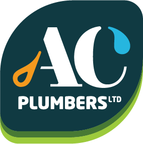

# AC Plumbing Website

A professional website for AC Plumbing services built with Astro and Tailwind CSS.



## 📋 Overview

This website showcases AC Plumbing's services, expertise, and contact information. It's designed to be fast, responsive, and easily maintainable.

## 🚀 Project Structure

```text
/
├── public/               # Static assets like images and favicon
├── src/
│   ├── components/       # Reusable UI components
│   ├── layouts/          # Layout components including header and footer
│   ├── pages/            # Each .astro file becomes a route
│   └── styles/           # Global styles and Tailwind configuration
└── package.json          # Project dependencies and scripts
```

The website uses a component-based architecture for easy maintenance and scalability. Tailwind CSS provides utility-first styling for rapid development.

## 🧞 Development Commands

All commands are run from the root of the project, from a terminal:

| Command           | Action                                       |
| :---------------- | :------------------------------------------- |
| `npm install`     | Installs dependencies                        |
| `npm run dev`     | Starts local dev server at `localhost:4321`  |
| `npm run build`   | Build your production site to `./dist/`      |
| `npm run preview` | Preview your build locally, before deploying |

## ✨ Features

- **Fast Performance**: Built with Astro for optimal loading speeds
- **Responsive Design**: Works seamlessly on all devices using Tailwind CSS
- **Service Showcase**: Detailed information about plumbing services offered
- **Contact Information**: Easy ways for potential customers to get in touch
- **SEO Optimized**: Structured for better search engine visibility

## 🔧 Technologies Used

- [Astro](https://astro.build/) - The web framework for content-driven websites
- [Tailwind CSS](https://tailwindcss.com/) - Utility-first CSS framework
- [TypeScript](https://www.typescriptlang.org/) - For type-safe JavaScript

## 📱 Contact

AC Plumbing Services
📞 Phone: [Your Phone Number]
✉️ Email: [Your Email]
📍 Location: [Your Location]
